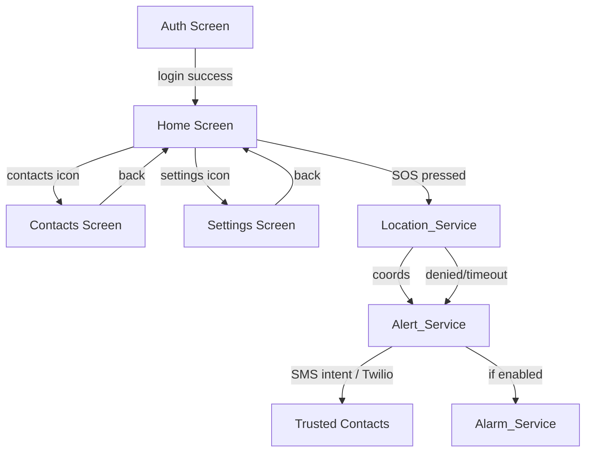

# Design Document: Women Safety Alert

## Overview

Women Safety Alert is a single-file web application (`index.html`) that lets a user quickly send an SOS alert — including a live GPS location link — to up to 3 pre-saved trusted contacts. The entire app ships as one HTML file containing inline CSS and JavaScript.

**Tech Stack**
- HTML + CSS + JavaScript (single file, no build step)
- Firebase Authentication — email/password and phone OTP
- Firebase Firestore — trusted contacts storage per user
- Browser Geolocation API — GPS coordinates
- SMS delivery — native `sms:` URI intent (device SMS app) as primary; Twilio REST API as optional server-side fallback
- Web Audio API — synthesized alarm sound (no external audio file needed)

**Key Design Decisions**
- Single-file constraint means all Firebase SDK imports come from CDN (`<script type="module">`).
- SMS is sent via the device's native SMS intent (`sms:?body=...&addresses=...`) which opens the SMS app pre-filled. This works on mobile without a backend. A Twilio Cloud Function URL can be configured as an optional fallback for automated sending.
- The alarm uses the Web Audio API to generate a tone, avoiding the need for an audio asset.
- Firebase config is embedded in the HTML file (public-facing keys are safe for client-side Firebase; Firestore security rules enforce access control).

---

## Architecture

The app is a single-page application with four logical screens rendered by toggling CSS visibility:

1. **Auth Screen** — login / register
2. **Home Screen** — SOS button + alarm toggle
3. **Contacts Screen** — add / delete trusted contacts
4. **Settings Screen** — alarm enable/disable, sign out



**Module boundaries (all within one JS `<script type="module">` block)**

| Module | Responsibility |
|---|---|
| `AuthService` | Firebase Auth — register, login, session persistence |
| `ContactManager` | Firestore CRUD for trusted contacts |
| `LocationService` | Geolocation API wrapper |
| `AlertService` | Compose SMS message, open SMS intent or call Twilio |
| `AlarmService` | Web Audio API tone generator |
| `Router` | Show/hide screens, manage nav state |

---

## Components and Interfaces

### AuthService

```js
AuthService.registerWithEmail(email, password) → Promise<UserCredential>
AuthService.registerWithPhone(phoneNumber)      → Promise<ConfirmationResult>
AuthService.confirmOTP(confirmationResult, otp) → Promise<UserCredential>
AuthService.loginWithEmail(email, password)     → Promise<UserCredential>
AuthService.logout()                            → Promise<void>
AuthService.currentUser()                       → FirebaseUser | null
AuthService.onAuthStateChanged(callback)        → Unsubscribe
```

### ContactManager

```js
ContactManager.getContacts(uid)              → Promise<Contact[]>
ContactManager.addContact(uid, contact)      → Promise<void>   // throws if >= 3
ContactManager.deleteContact(uid, contactId) → Promise<void>
```

### LocationService

```js
LocationService.requestPermission()          → Promise<'granted'|'denied'>
LocationService.getCurrentLocation()         → Promise<LocationResult>

// LocationResult:
// { status: 'ok', lat: number, lng: number, mapsUrl: string }
// { status: 'denied' }
// { status: 'timeout' }
```

### AlertService

```js
AlertService.sendSOS(uid) → Promise<SOSResult>

// SOSResult:
// { sent: string[], failed: string[] }
```

`sendSOS` orchestrates: fetch contacts → get location → compose message → open SMS intent (or POST to Twilio endpoint).

### AlarmService

```js
AlarmService.start()  → void
AlarmService.stop()   → void
AlarmService.isPlaying() → boolean
```

### Router

```js
Router.navigate(screen: 'auth'|'home'|'contacts'|'settings') → void
```

---

## Data Models

### Firestore Collection Structure

```
/users/{uid}/contacts/{contactId}
```

### Contact Document

```json
{
  "id": "auto-generated Firestore doc ID",
  "name": "string (1–50 chars)",
  "phone": "string (E.164 format, e.g. +919876543210)"
}
```

### In-Memory App State

```js
const state = {
  user: null,            // FirebaseUser | null
  contacts: [],          // Contact[]
  alarmEnabled: true,    // boolean (persisted in localStorage)
  alarmPlaying: false    // boolean
};
```

### localStorage Keys

| Key | Value | Purpose |
|---|---|---|
| `wsa_alarm_enabled` | `"true"` / `"false"` | Persist alarm preference across sessions |

### SMS Message Template

```
"I am in danger. Please help. My location: https://maps.google.com/?q={lat},{lng}"
```

When location is unavailable:
```
"I am in danger. Please help. (Location unavailable)"
```

---

## Correctness Properties

*A property is a characteristic or behavior that should hold true across all valid executions of a system — essentially, a formal statement about what the system should do. Properties serve as the bridge between human-readable specifications and machine-verifiable correctness guarantees.*

### Property 1: Valid credentials produce a user account

*For any* valid email address and password pair, calling `AuthService.registerWithEmail` should resolve to a user credential with a non-null `uid`.

**Validates: Requirements 1.1, 1.3**

---

### Property 2: Invalid credentials produce an error message

*For any* input where the email is malformed or the password is too short, the auth flow should reject the attempt and surface a non-empty error string to the UI — never silently failing.

**Validates: Requirements 1.4**

---

### Property 3: Register then login round-trip

*For any* valid email/password pair, registering and then logging in with the same credentials should result in an authenticated session with the same `uid`.

**Validates: Requirements 1.5**

---

### Property 4: Add contact round-trip

*For any* valid contact (name + E.164 phone number), calling `ContactManager.addContact` followed by `ContactManager.getContacts` should return a list that contains the added contact.

**Validates: Requirements 2.1, 2.5**

---

### Property 5: Contact list never exceeds 3

*For any* sequence of add-contact operations, the length of the contacts list returned by `ContactManager.getContacts` should never exceed 3. When the list already has 3 contacts, any further add attempt should throw/reject with an error.

**Validates: Requirements 2.2, 2.3**

---

### Property 6: Delete contact removes it

*For any* contact that exists in the list, calling `ContactManager.deleteContact` should result in `ContactManager.getContacts` returning a list that no longer contains that contact.

**Validates: Requirements 2.4**

---

### Property 7: Contacts screen displays all saved contacts

*For any* set of contacts stored in Firestore, the contacts rendered in the DOM after loading the contacts screen should contain exactly the same names and phone numbers — no more, no fewer.

**Validates: Requirements 2.6**

---

### Property 8: Invalid phone numbers are rejected

*For any* string that does not match a valid E.164 phone number pattern, the phone validation function should return `false` and no Firestore write should occur.

**Validates: Requirements 2.7**

---

### Property 9: SOS sends correctly formatted messages to all contacts

*For any* non-empty list of trusted contacts and any GPS coordinate pair (or location-denied status), calling `AlertService.sendSOS` should attempt to send a message to every contact, and each message body should contain the expected danger text and either a valid `maps.google.com` URL or the fallback unavailability notice.

**Validates: Requirements 3.2, 3.3, 3.5**

---

### Property 10: Failed contacts are reported by name

*For any* subset of contacts for which SMS delivery fails, the `SOSResult.failed` array returned by `AlertService.sendSOS` should contain exactly the names of those contacts — no more, no fewer.

**Validates: Requirements 3.6**

---

### Property 11: Maps URL format for any coordinates

*For any* latitude value in [-90, 90] and longitude value in [-180, 180], `LocationService.getCurrentLocation` (when successful) should return a `mapsUrl` of the form `https://maps.google.com/?q={lat},{lng}`.

**Validates: Requirements 4.2**

---

### Property 12: Alarm toggle is a round-trip

*For any* initial alarm-enabled state, toggling the alarm setting twice should return the state to its original value, and the `localStorage` key `wsa_alarm_enabled` should reflect the final state accurately.

**Validates: Requirements 5.4**

---

## Error Handling

| Scenario | Handling |
|---|---|
| Firebase Auth error (wrong password, user not found) | Show generic "Invalid credentials" message — do not reveal which field failed (Req 1.6) |
| Firebase Auth error (email already in use) | Show "An account with this email already exists" |
| Firestore write failure (add contact) | Show inline error, do not update local state |
| Geolocation permission denied | `LocationService` returns `{ status: 'denied' }`; Alert proceeds without location |
| Geolocation timeout (>10 s) | `LocationService` returns `{ status: 'timeout' }`; Alert proceeds without location |
| SMS intent not supported (desktop browser) | Show a copyable pre-filled message so the user can send manually |
| Twilio API error (if configured) | Log error, mark contact as failed in `SOSResult.failed` |
| No trusted contacts on SOS press | Show modal: "Please add at least one emergency contact first" |
| Web Audio API unavailable | Alarm feature silently disabled; settings toggle hidden |
| Network offline during Firestore read | Show cached data if available; show "Offline — contacts may be outdated" banner |

---

## Testing Strategy

### Dual Testing Approach

Both unit tests and property-based tests are required. They are complementary:
- Unit tests catch concrete bugs at specific inputs and integration points.
- Property-based tests verify universal correctness across the full input space.

### Unit Tests (specific examples & edge cases)

Focus areas:
- Auth screen renders login/register forms correctly
- OTP flow: mock `ConfirmationResult`, verify `confirmOTP` resolves
- Session persistence: mock `onAuthStateChanged` firing with a user, verify home screen shown
- SOS with 0 contacts → prompt shown (Req 3.4)
- SOS with location denied → fallback message sent (Req 3.5)
- SOS success → confirmation banner shown (Req 3.7)
- Geolocation timeout after 10 s → `status: 'timeout'` returned (Req 4.3)
- Alarm starts on SOS when enabled (Req 5.1)
- Stop button appears while alarm plays (Req 5.2)
- Stop button stops alarm (Req 5.3)
- Error message on auth failure does not mention "email" or "password" specifically (Req 1.6)

### Property-Based Tests

Library: **fast-check** (loaded from CDN in test harness, or via npm for a separate test file).

Minimum 100 iterations per property test.

Each test must be tagged with a comment in the format:
`// Feature: women-safety-alert, Property {N}: {property_text}`

| Property | Test Description |
|---|---|
| P1 | `fc.emailAddress()` × `fc.string()` → register resolves with uid |
| P2 | `fc.string()` (invalid emails) → register rejects with non-empty error |
| P3 | `fc.emailAddress()` × `fc.string()` → register then login yields same uid |
| P4 | `fc.record({name, phone})` → add then getContacts contains the record |
| P5 | `fc.array(validContact, {maxLength: 10})` → contacts.length ≤ 3 always |
| P6 | `fc.array(validContact, {minLength:1})` → delete one → not in list |
| P7 | `fc.array(validContact, {maxLength:3})` → DOM contains all names/phones |
| P8 | `fc.string()` (non-E.164) → isValidPhone returns false |
| P9 | `fc.array(validContact, {minLength:1})` × `fc.option(coords)` → message body correct |
| P10 | `fc.array(validContact)` × `fc.subarray(contacts)` (failed set) → failed names match |
| P11 | `fc.float({min:-90,max:90})` × `fc.float({min:-180,max:180})` → URL matches pattern |
| P12 | `fc.boolean()` → toggle twice → original value in localStorage |

### Test File Structure

Since the app is a single HTML file, tests live in a companion file `index.test.js` that imports the extracted module functions. The core logic modules (`AuthService`, `ContactManager`, `LocationService`, `AlertService`, `AlarmService`) should be written as pure ES module functions that can be imported independently of the DOM, enabling straightforward unit and property testing.
